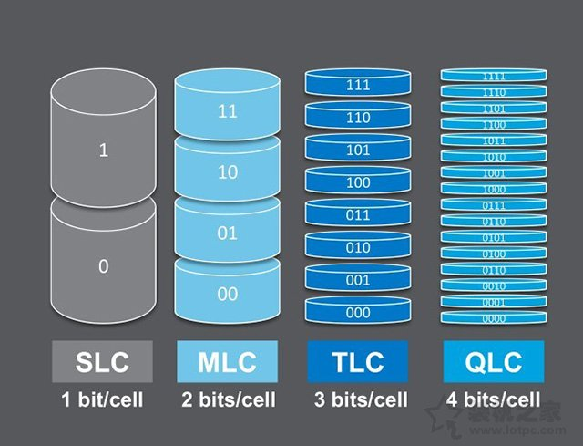
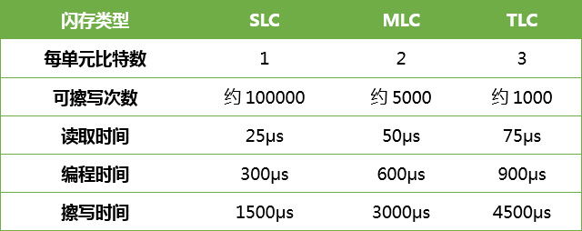

# 计算机中的存储器

## 内部存储器（内存、主存）

**内存工作原理**：内存是用来存放当前正在使用的（即执行中）的数据和程序，我们平常所提到的计算机的内存指的是动态内存（即DRAM），动态内存中所谓的"动态"指的是当我们将数据写入DRAM后，经过一段时间，数据会丢失，因此需要一个额外设电路进行内存刷新操作。 

具体的工作过程是这样的：一个DRAM的存储单元存储的是0还是1取决于电容是否有电荷，有电荷代表1，无电荷代表0。但时间一长，代表1的电容会放电，代表0的电容会吸收电荷，这就是数据丢失的原因；刷新操作定期对电容进行检查，若电量大于满电量的1／2，则认为其代表1，并把电容充满电；若电量小于1／2，则认为其代表0，并把电容放电，藉此来保持数据的连续性。

1. ### 随机存储器（RAM）

   随机存取存储器，也叫主存，是与CPU直接交换数据的内部存储器。它可以随时读写（刷新时除外），而且速度很快，通常作为操作系统或其他正在运行中的程序的临时数据存储介质。RAM工作时可以随时从任何一个指定的地址写入（存入）或读出（取出）信息。它与ROM的最大区别是数据的易失性，即一旦断电所存储的数据将随之丢失。RAM在计算机和数字系统中用来暂时存储程序、数据和中间结果。 

   1. #### 静态随机存储器（SRAM）

      静态存储单元是在静态触发器的基础上附加门控管而构成的。因此，它是靠触发器的自保功能存储数据的。SRAM存放的信息在不停电的情况下能长时间保留，状态稳定，不需外加刷新电路，从而简化了外部电路设计。但由于SRAM的基本存储电路中所含晶体管较多，故集成度较低，且功耗较大。分为双极型（BJT）和MOS型。

      优点：速度快、使用简单、不需刷新、静态功耗极低；常用作Cache。

      缺点：元件数多、集成度低、运行功耗大。

   2. #### 动态随机存储器（DRAM）

      DRAM利用电容存储电荷的原理保存信息，电路简单，集成度高。由于任何电容都存在漏电，因此，当电容存储有电荷时，过一段时间由于电容放电会导致电荷流失，使保存信息丢失。因此每隔一定时间（一般为2ms）须对DRAM进行读出和再写入，即DRAM的刷新。由MOS管构成。DRAM常用于作主存储器（内存条）

      优点： 集成度远高于SRAM、功耗低，价格也低。

      缺点：因需刷新而使外围电路复杂；刷新也使存取速度较SRAM慢。

      DRAM分为很多种，常见的主要有FPRAM/FastPage、EDORAM、SDRAM、DDR RAM、RDRAM、SGRAM以及WRAM等。 

      DDR RAM（Date-Rate RAM）也称作DDR SDRAM，这种改进型的RAM和SDRAM是基本一样的，不同之处在于它可以在一个时钟读写两次数据，这样就使得数据传输速度加倍了。这是目前电脑中用得最多的内存，而且它有着成本优势，事实上击败了Intel的另外一种内存标准－Rambus DRAM。在很多高端的显卡上，也配备了高速DDR RAM来提高带宽，这可以大幅度提高3D加速卡的像素渲染能力。

   3. #### CMOS(Complementary Metal Oxide Semiconductor)

      即金属互补氧化物半导体，是电脑主板上一块可读写的RAM芯片。功耗低，CMOS RAM芯片由系统通过后备电池供电，在关机状态中，还是遇到系统掉电，CMOS信息不会丢失。CMOS用来保存当前系统的硬件配置和操作人员对某些参数的设定（BIOS软件设置的参数）。

2. ### 只读存储器（ROM）

   只读存储器（Read-Only Memory，ROM）以非破坏性读出方式工作，只能读出无法写入信息。信息一旦写入后就固定下来，即使切断电源，信息也不会丢失，所以又称为固定存储器。ROM一般作为固件，用来存放一些硬件的驱动程序

   1. #### 掩模型ROM(MROM)

      Mask Read-Only Memory，掩模式只读存储器的内容是由半导体制造厂按用户提出的要求在芯片的生产过程中直接写入的，写入之后任何人都无法改变其内容。

   2. #### 可编程ROM(PROM)

      Programmable read-only memory，可编程只读存储器被编程后，它就只能专用那些数据，并且不能被再编程，内容是永久性的。结构分为熔丝烧断型和PN结击穿型。有透明窗。常用于工业控制机或电器中。

   3. #### 可擦除PROM(EPROM)

      Erasable Programmable Read-Only Memory，可编程可擦除只读存储器，可多次编程，是一种以读为主的可写可读的存储器。分为电可改写ROM（用电擦除）和光可改写ROM（用紫外线照射的方法），一次性全部擦除，有透明窗。

   4. #### 电可擦除PROM(EEPROM)

      Electrically Erasable Programmable Read-Only Memory，电可擦可编程序只读存储器是一种随时可写入而无须擦除原先内容的存储器。浮栅隧道结构，可逐字擦写，速度快，不需要从设备上取出。按字节进行删除和重写, 写入时间很长，写入很慢;现在多用作非易失的数据存储器。特点是可以随机访问和修改任何一个字节，可以往每个bit中写入0或者1。这是最传统的一种EEPROM，掉电后数据不丢失，可以保存100年，可以擦写100w次。具有较高的可靠性，但是电路复杂/成本也高。因此目前的EEPROM都是几十千字节到几百千字节的，绝少有超过512K的。

   5. #### 一次编程只读内存（OTPROM）

      One Time Programmable Read Only Memory， 一次编程只读内存，写入原理同EPROM，但是为了节省成本，编程写入之后就不再抹除，因此不设置透明窗。

## 外部存储器（外存、辅存）

1. ### 磁盘

   1. #### 硬盘
   
      1. ##### HDD(Hard Disk Drive)

         硬盘驱动器，最基本的电脑存储器，也就是机械硬盘，靠磁场存储信息，故也称为磁盘。

      2. ##### SSD（Solid State Drives）

         固态硬盘，简称固盘。由控制单元和存储单元（FLASH芯片、DRAM芯片）组成。固态硬盘的存储介质分为两种，一种是采用闪存（FLASH芯片）作为存储介质，另外一种是采用DRAM作为存储介质。3D NAND闪存颗粒分为以下几种：

         **SLC（单层存储单元）**

         全称是Single-Level Cell，单层电子结构，每个cell可以存放1bit数据，SLC达到1bit/cell，写入数据的时候电压变化区间小，P/E寿命较长，理论擦写次数在10万次以上，但是由于成本最高，所以SLC颗粒多数用于企业级高端产品中。

         **MLC（双层存储单元）**

         全称是Multi-Level Cell，使用高低电压的而不同构建的双层电子结构，MLC达到2bit/cell，P/E寿命较长，理论擦写次数在3000-5000次左右，成本相对较高，但是对于消费级来说也可以接受，多用于家用级高端产品中。

         **TLC（三层存储单元）**

         全称是Trinary-Level Cell，三层式存储单元，是MLC闪存延伸，TLC达到3bit/cell，由于存储密度较高，所以容量理论上是MLC的1.5倍，成本较低，但是P/E寿命相对要低一些，理论擦写次数在1000-3000次不等，是目前市面上主流的闪存颗粒。

         **QLC（四层存储单元）**

         全称是Quad-Level Cell，四层式存储单元，QLC闪存颗粒拥有比TLC更高的存储密度，同时成本上相比TLC更低，优势就是可以将容量做的更大，成本上更低，劣势就是P/E寿命更短，理论擦写次数仅150次。
         
         
         

        
         

   2. #### 软盘（Floppy Disk）

   3. #### 磁带

      在塑料薄膜带基（支持体）上涂覆一层颗粒状磁性材料或蒸发沉积上一层磁性氧化物或合金薄膜而成。

2. ### 光盘

   光盘是以光信息做为存储的载体并用来存储数据的一种物品，利用激光原理进行读、写。分不可擦写光盘，如CD-ROM、DVD-ROM等；和可擦写光盘，如CD-RW、DVD-RAM等。

3. ### 缓冲存储器（Cache）

   缓冲存储器是一种高速缓冲存储器，是为了解决CPU和主存之间速度不匹配而采用的一项重要技术。Cache是介于CPU和主存之间的小容量存储器，但存取速度比主存快。从功能上看，它是主存的缓冲存储器，由高速的SRAM组成。为追求高速，包括管理在内的全部功能均由硬件实现，因而对程序员是透明的。

4. ### 闪速存储器（Flash Memory）

   即**闪存**，快擦除读写存储器，属于不挥发性（ Non-Volatile ）内存。兼具RAM和EEPROM的特点，不仅具备电子可擦除可编程（EEPROM）的性能，还不会断电丢失数据同时可以快速读取数据（NVRAM的优势）。FLASH属于广义上的ROM，和EEPROM的最大区别是FLASH按扇区操作，相对于EEPROM的改进就是擦除时不再以字节为单位，而是以块为单位，一次简化了电路，数据密度更高，降低了成本。

   常用于SSD，U盘，MP3，手机相机存储卡，嵌入式系统等。BIOS程序也用flash存储。上M的ROM一般都是FLASH。目前Flash主要有两种**NOR Flash**和**NAND Flash**。
